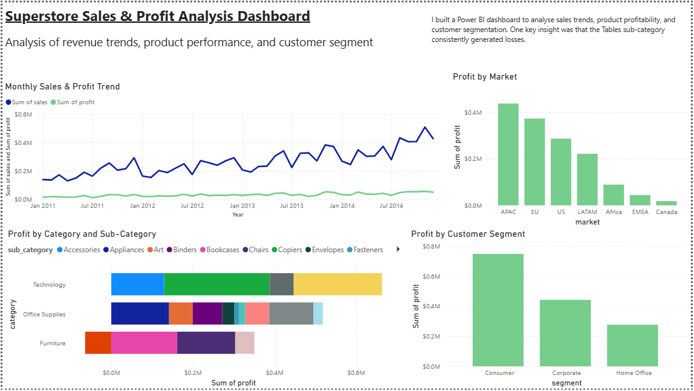

# sales-performance-analysis
Analysis of sales data to identify trends, conversion rates, and performance insights using SQL and Power BI

# Superstore Sales & Profit Analysis

## Project Overview
This project analyses sales and profitability using SQL and Power BI to identify key business insights.

## Tools Used
- SQL (SQLite)
- Power BI
- Google Sheets (data cleaning)

## Dashboard

## Key Analysis
- Monthly Sales & Profit Trends
- Category & Sub-Category Performance
- Regional Analysis
- Customer Segment Analysis

## Key Insights

- Sales show a consistent upward trend year-over-year, indicating overall business growth.
- A recurring seasonal pattern is visible, with sales increasing towards the end of each quarter (March, June, September, December), followed by a drop at the start of the next period.
- The highest sales peaks generally occur in December, highlighting strong end-of-year performance, with a slight variation in 2013 where November was the peak.
- Technology is the largest contributor to both sales and profit, followed by Office Supplies.
- The Tables sub-category is consistently unprofitable, indicating a potential issue with pricing or cost structure.
- The Consumer segment generates the highest overall profit, making it the most valuable customer group.

- Despite strong overall performance, the Tables sub-category consistently generates negative profit, suggesting inefficiencies in pricing, cost management, or discounting strategy.

## Data Cleaning & Preparation
- Standardised inconsistent date formats using Google Sheets
- Created a normalised date column for monthly aggregation

- Identified inconsistencies in the `Region` field, where it combined both US sub-regions (e.g., South, West) and broader international groupings, leading to unclear and potentially misleading segmentation.
- To address this, the analysis was adjusted to use the `Market` field, which provides more consistent geographic groupings at a continental level.
- Additionally, the United States and Canada were treated as separate entities to better reflect their significance as key markets.
- This ensured that regional comparisons were meaningful and analytically sound.

## Project Structure
- `/sql` → SQL queries
- `/dashboard` → Power BI visuals
- `/data` → dataset 
